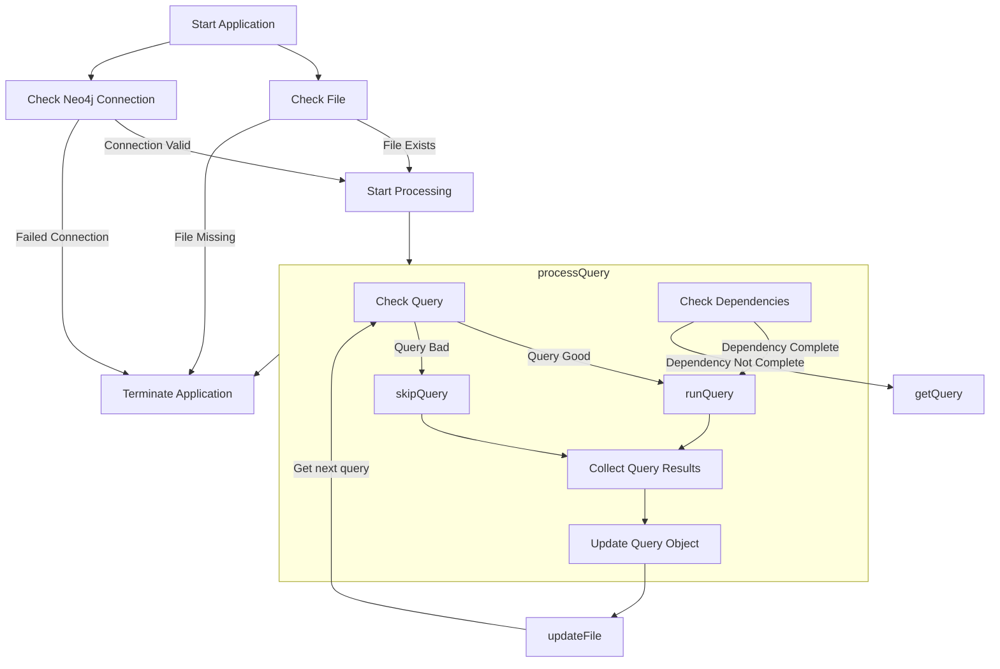

```mermaid
flowchart TD
  %% Steps
  startApplication[Start Application]
  checkFile[Check File]
  startProcessing[Start Processing]
  terminateApplication[Terminate Application]
  checkQuery[Check Query]
  checkNeo4jConnection[Check Neo4j Connection]
  processQuery[Process Query]
  collectResults[Collect Query Results]
  updateQueryObject[Update Query Object]
  checkDependencies[Check Dependencies]

  subgraph processQuery
    checkQuery
    runQuery
    skipQuery
    collectResults
    updateQueryObject
    checkDependencies
  end

  %% Connections
  startApplication --> checkFile
  startApplication --> checkNeo4jConnection
  checkNeo4jConnection -- Connection Valid --> startProcessing
  checkNeo4jConnection -- Failed Connection --> terminateApplication
  checkFile -- File Exists --> startProcessing
  checkFile -- File Missing --> terminateApplication
  startProcessing --> processQuery

  checkQuery -- Query Good --> runQuery
  checkQuery -- Query Bad --> skipQuery
  checkDependencies -- Dependency Complete --> runQuery
  checkDependencies -- Dependency Not Complete --> getQuery
  runQuery --> collectResults
  skipQuery --> collectResults
  collectResults --> updateQueryObject
  updateQueryObject --> updateFile
  updateFile -- Get next query --> checkQuery

  processQuery --> terminateApplication
```