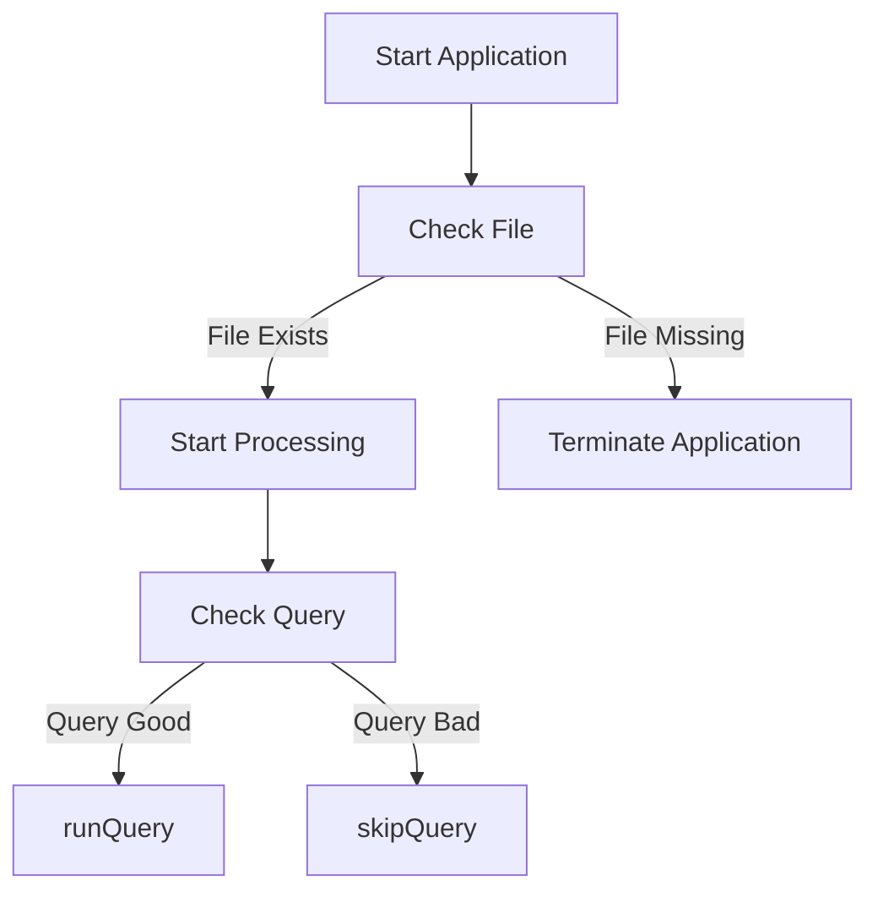

```mermaid
flowchart TD
  %% Steps
  startApplication[Start Application]
  checkFile[Check File]
  startProcessing[Start Processing]
  terminateApplication[Terminate Application]
  checkQuery[Check Query]

  %% Connections
  startApplication --> checkFile
  checkFile -- File Exists --> startProcessing
  checkFile -- File Missing --> terminateApplication
  startProcessing --> checkQuery
  checkQuery -- Query Good --> runQuery
  checkQuery -- Query Bad --> skipQuery
```